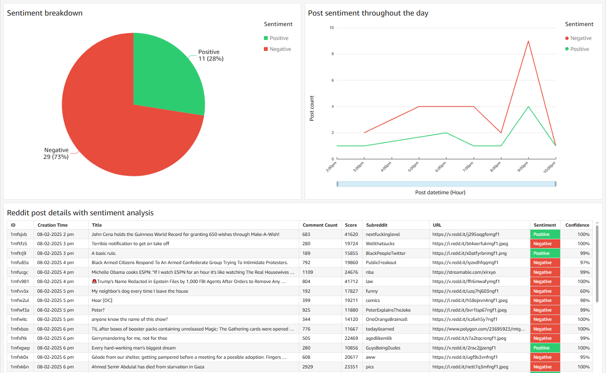

# RedStream

RedStream is a completely serverless, AI-enabled data pipeline built on AWS and provisioned with Terraform. The pipeline leverages real-time streaming, intelligent filtering, sentiment analysis, and a robust architecture that is both performant and fault tolerant. This was created primarily for experimentation and learning purposes.

## Tech Stack

- Python 3
- Terraform
- Amazon Lambda Functions
- Amazon Kinesis Data Streams
- Amazon Data Firehose
- Amazon EventBridge
- Amazon SageMaker AI
- Amazon S3 Buckets
- Amazon Athena

## Features

- Automated event scheduling via Amazon EventBridge to invoke data collection Lambda every 5 minutes
- Real-time ingestion and multi-consumer fan-out processing using Amazon Kinesis Data Streams
- AI-powered data enrichment using an AWS Lambda consumer integrated with a SageMaker AI sentiment analysis endpoint
- Serverless data filtering with EventBridge Pipes for efficient conditional routing
- Dynamic, schema-on-read data storage using Amazon Kinesis Firehose with partitioned delivery to Amazon S3
- Cloud-native query layer using Amazon Athena with Glue Catalog tables and SQL-based views
- Scalable, fault-tolerant, and fully managed architecture leveraging AWS-native serverless services
- Infrastructure-as-Code provisioning with Terraform for reproducibility, automation, and modularity

## Architecture


## License

This project is licensed under the MIT License – see the [LICENSE](LICENSE) file for details.

## Disclaimer

This project is provided as is, without warranty of any kind. It was created as a personal experiment and is not actively maintained. Use it at your own risk.

## Contributing

Feel free to create an issue if you encounter any bugs or errors.

## Getting Started

Download the repo with:
```
git clone https://github.com/zcstanley24/red-stream.git
```

Create a local `.env` in the root of the downloaded repo with `touch .env`, then add your local environment variables to the new file.
```
REDDIT_CLIENT_ID=your-client-id
REDDIT_CLIENT_SECRET=your-client-secret
REDDIT_USER_AGENT=your-chosen-user-agent
INPUT_STREAM_NAME=your-input-stream-name
OUTPUT_STREAM_NAME=your-output-stream-name
SAGEMAKER_ENDPOINT_NAME=your-sentiment-endpoint-name
```

If you don't have one already, you'll need to create a Reddit account, and then you can obtain Reddit API credentials via [this link](https://www.reddit.com/prefs/apps)

You will also want to have Python, Terraform, and the AWS CLI installed. This project was built with Python 3.8.10, Terraform v1.12.2, and AWS-CLI 2.27.60, but the latest stable versions will likely work just fine for a few years.

If you want to run the pipeline as-is, you should be able to run `./scripts/run_terraform.sh plan` from the project root to validate the terraform, then `./scripts/run_terraform.sh apply` to execute it. If terraform fails to run, be sure you're logged in to a valid AWS account with `aws sts get-caller-identity`.

If you want to make changes to the pipeline, most infrastructure changes should be automatically picked up by terraform when you apply them. If you need to modify either of the lambda function scripts, make sure you run `./scripts/pacakage_lambda_function.sh producer` with either "producer" or "transformer" as an argument depending on which one you are updating. Then you can just zip the resulting build directory contents with the following format `lambda_producer_payload.zip` and replace the old zip in the lambda terraform module. This change should be recognized by terraform and deployed with your next apply.

You should see all of the resulting infrastructure from your AWS console (you can also validate the infrastructure was created from the CLI). The only manual intervention required should be setting your desired query output S3 bucket in Athena, and running the saved query `reddit_joined_view` to ensure the corresponding view is created by Athena. You should be able to verify the entire pipeline is running as expected by checking for partitioned Reddit data in your S3 bucket within 5 minutes of provisioning the pipeline.

If you run into any problems, please feel free to create an issue in Github.

## Additional Pipeline Details

### Lambda Producer
- Triggered via EventBridge every 5 minutes
- Connects to Reddit API via PRAW and sends data from top 20 hottest posts to Kinesis input stream

### EventBridge Pipe
- Reads from Kinesis input stream and filters data to ensure the post has at least 10 comments and an identifiable author
- Appends source attribute and sends filtered data to Kinesis output stream

### Lambda Transformer
- Reads from Kinesis input stream and calls SageMaker AI endpoint to obtain sentiment analysis for each post title
- Appends source attribute and sentiment data, then sends data to Kinesis output stream

### Kinesis Firehose
- Reads from Kinesis output stream and partitions data by sending to S3 bucket directory based on source attribute value

### Athena
- Reads from the two data directories in the output S3 bucket and populates detailed Reddit post table and sentiment analysis table accordingly
- Joins the two tables by ID and filters out duplicates in the combined view

## QuickSight Dashboard Example

Here's an example of a QuickSight dashboard built with the final joined view generated by Athena.

